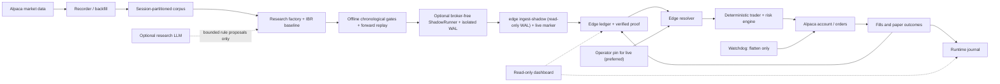

# Alpaca intraday trading agent

This repository is a research and execution skeleton for US equities, ETFs,
and listed OCC options through Alpaca. Paper mode is the default: collect
regular-session data, evaluate multiple strategy hypotheses and their variants,
and record every decision and fill for review. The supported universe is
US-listed equities/ETFs and listed OCC options only; crypto is rejected.
Options are single-leg long calls or puts
(buy-to-open, sell-to-close); multi-leg and naked/short option structures are
unsupported. No performance claim is made.

## What this repository does

This is not an LLM that watches prices and improvises orders. It is a set of
separate, deliberately limited systems:

1. **Recorder and backfill** collect point-in-time market observations into an
   append-only, session-partitioned corpus.
2. **Research** searches a closed strategy grammar, simulates candidates, and
   applies chronological statistical gates.
3. **The edge ledger** stores candidate state, source evidence, proof hashes,
   and the exact parity-matched live-shadow run that authorizes deployment.
4. **The trader** resolves only proved ledger records, recomputes their
   deterministic signals, applies account-wide risk limits, and submits orders.
5. **State, journal, watchdog, and health services** reconcile broker truth,
   make retries idempotent, expose degraded conditions, and flatten when that
   can be done safely.



### How edge discovery works

The strategy factory normally runs seven logical research slots. Each slot
holds one hypothesis and evaluates four isolated-account variants drawn from
the finite catalog of eleven bounded rule families. It diagnoses only
chronological fit data, then judges the variants on untouched held-out data.
Candidates are de-duplicated by their family-specific executable semantic
signature (including v1/v2 no-op aliases), while a variant id with an adequate
recorded failure is suppressed exactly; underpowered results remain eligible.
A candidate must clear structural trade/session floors, matched controls,
absolute after-cost profitability, falsification, fixed-rule rolling-origin
stability, and family-local, cycle-global, and cumulative online false-discovery
correction. A family can legitimately pass its local test but fail the global
one; only the global result can authorize cross-family selection.

The final qualification sessions are sealed before the workers run. After
development ranking and correction preselect one candidate, that candidate
alone consumes the sealed window; other variants remain diagnostic. Candidate
and baseline observations, declared sessions, and content digests are bound
into the verified gate so the qualification decision can be recomputed.
A backtest pass is still not deployable. Offline historical or forward replay
may persist a passing `lane=shadow` candidate proof, but that status is
stability evidence only and never authorizes the runtime. A strictly newer
recorder tail must be evaluated by the broker-free ShadowRunner, then consumed
by `edge ingest-shadow` as a complete parity-matched proof before the candidate
can become `validated` or `champion`. An underpowered, mismatched, or incomplete
shadow cycle advances no durable boundary, so those sessions are reconsidered
when enough data exists instead of being silently consumed.

When a slot proves an edge, the proved rule is frozen and the slot is reseeded
with a new hypothesis so research capacity does not shrink. Retirement requires
adequate terminal negative evidence for every intended variant (and a valid
bounded replacement when enabled); a demoted candidate may re-prove on a newer
shadow run and starts a new evidence epoch. Paper
`selection_mode: all_proved` can then select one strongest proved variant per
independent family under one global risk book and correlation cap. Live paper
outcomes are scoped to the exact shadow proof that authorized the trade; if the
same candidate is later demoted, re-proved, and re-trialled, old outcomes do not
decide the new trial.

### How trading works

Every cycle begins with broker reconciliation and fresh clock, calendar, quote,
account, and position checks. The selected proved rule produces a deterministic
setup. The risk engine then decides whether it fits daily loss, open-risk,
gross-exposure, position, liquidity, spread, and buying-power limits. Only after
those checks does the provider submit an idempotently named day order.

Equities use broker-side brackets. Long options are paper-only because Alpaca
does not provide an option stop order: the runtime rests a broker-side
take-profit, keeps the stop locally, and relies on the separate watchdog as a
stale-process backstop. Protective orders must be broker-confirmed canceled
before a local close is submitted. Startup, shutdown, force-flat, and crash
recovery all reconcile against broker state; an unreadable state file is a
blocking safety fault, never an empty book.

A trader process uses one execution profile (`shares` or `options`) at a time.
The market calendar is America/New_York (NYSE regular session). Entries outside
the session are rejected, orders are day-only, and positions are force-closed
before the close. Research replay receives the same runtime `ReplayPolicy`:
strict 30-second market/quote freshness, configured DTE (default 7–60), option
spread and liquidity checks, latest-entry and force-flat cutoffs, and
portfolio/risk limits (position count/notional, gross/open risk, and daily
loss) are all enforced rather than relaxed for simulation.

### Where the LLM is used

| Lane | What the model may do | What it cannot do |
| --- | --- | --- |
| Research | Propose a new bounded hypothesis, a replacement, or parameter values inside the validated rule grammar | Write executable strategy code, add data sources or indicators, skip a gate, validate a candidate, promote it, size it, or place an order |
| Optional paper runtime | Return a subtractive veto after the deterministic setup and risk prerequisites already exist | Create a setup, change side/quantity/price, bypass risk, or submit an order |
| Live runtime | Nothing; `llm.enabled: true` and injected decision brains are rejected | Participate in any live trading decision |

Research works without an LLM because every proposal path has a deterministic
fallback. Discovery, replacement, and tuning use strict full-schema structured
contracts (`additionalProperties: false`, including the complete rule
specification), and record schema/grammar hashes. The adapter enforces a
per-run total-call budget, per-call attempt/timeout/response bounds, and an
authentication circuit that stops further calls after an auth failure; result
evidence records call counts, circuit state, and each attempt's hashes/errors.
The optional paper-runtime call has a strict timeout. Empty or irrelevant
output means “no veto,” returning control to the already-audited deterministic
path; provider errors or malformed non-empty output veto that cycle. The LLM
never has broker authority.

Custom provider endpoints are a trust boundary. `llm.base_url`,
`OPENAI_BASE_URL`, and `ANTHROPIC_BASE_URL` can receive the provider key and the
prompt, so configure only a trusted HTTPS service; the application does not
currently enforce a host allowlist for LLM endpoints. Recorded hashes prove
which prompt/request/response was used, not that a provider will reproduce the
same answer later. The adapter's call budget is a per-run call-count guard, not
spend accounting; provider-side quotas remain an operational control for
unattended research.

## How an edge reaches money

Four states, and only one transition a machine cannot make.

| State | Who decides | Can it change on its own? |
| --- | --- | --- |
| **Research** — hypotheses, variants, gates | the factory | yes, continuously |
| **Proved** — `validated`/`champion` plus a live-shadow marker | the gates and live ingestion | yes, on evidence |
| **Trial** — trading the demo account, outcomes scoped to its authorizing shadow proof | automatic | yes: a trial below its floor is parked and its failure becomes a lesson |
| **Pinned** — an id you wrote into `config.yaml` | **you only** | **no.** Guards still run and still report; they raise an alert and leave it in place |

Promotion is the one step that is never automatic. When an edge clears its
trial, `research.py edge promotable` names the variant, shows what it actually
returned on the book, and prints the exact configuration block:

```bash
./.venv/bin/python research.py edge promotable
```

```json
{ "strategy": { "selection_mode": "pinned", "pinned": [
    { "id": "pin-equity-abc12345",
      "variant_id": "rule.opening-range-breakout.abc12345…",
      "vehicle": "equity", "strategy_id": "rule",
      "promoted_at": "2026-08-12",
      "note": "live paper: 34 trades over 21 sessions, total R 6.40" } ] } }
```

Paste it, restart the trader, and that edge is frozen: pinning exempts it from
automatic demotion, from trial parking, and from every other lane that would
otherwise move it. Pinning selects, it never authorizes — a pinned entry still
has to resolve to a proved ledger record with a re-verified passing proof, so
an id in a file cannot put an unproved variant on the book. A pin that cannot
resolve is reported rather than silently substituted.

Manual `edge promote` and offline replay cannot manufacture the live-shadow
marker. A legacy `validated` or `champion` row without that marker may be
evaluated by the live lane and migrated by `edge ingest-shadow`, but remains
ineligible until a new authorized parity-matched proof is appended.

Every `id` is yours and must be unique; it is the handle the audit trail, the
dashboard, and the notifications all use. Separately, every distinct
configuration the runtime loads is recorded with a content-addressed
`config_version_id` and a diff naming each field that moved, so any changed
value is traceable to a version, a time, and an actor. Secrets are recorded as
having changed, never as values. A configuration-audit write failure does not
halt a trader that may already own exposure; instead, the runtime keeps a
sticky degraded heartbeat with reason `config_audit_unavailable` until a later
successful audit clears it.

## Safety boundary

- Paper mode (`mode: paper`, `broker.paper: true`, `ALPACA_PAPER=true`) and
  Alpaca's paper endpoint are the documented defaults.
- Live mode is an explicit, separately reviewed configuration only: set
  `mode: live`, `broker.paper: false`, `broker.allow_live: true`, and
  `ALPACA_LIVE_ENABLE=true`; then either `strategy.selection_mode: pinned`
  with exactly one `strategy.pinned` entry, or `strategy.selection_mode:
  specific` with one exact named validated/champion `strategy.variant_id` whose
  latest shadow proof carries the live-ingestion marker.
  Prefer `pinned`: it carries an operator-assigned promotion id, so the audit
  trail can name who deployed the edge and when. Live mode pins that edge and
  does not auto-switch. Keep live configuration, credentials, and
  `ALPACA_AGENT_RUNTIME_ROOT` in a separate runtime scope from paper.
- `strategy.execution_mode: options` is paper-only. Alpaca offers no bracket,
  OCO, or stop order on options, so an option position's protective stop is
  software (the 60-second poller, bounded by the separate `watchdog` process)
  and `mode: live` rejects the options profile. If the broker or network is
  unreachable, nothing local protects an open option position.
- `mode: live` rejects `llm.enabled: true`. The validated edge was proven with
  the deterministic rule and no LLM in the loop, so enabling the runtime LLM
  veto in live would deploy a strategy that is not the one that passed the
  gates. Runtime decision LLM use stays off; the bounded research replacement
  adapter is a separate, offline setting.
- Keep API keys in `.env` or a host secret; never commit them. Use trading
  permissions only and disable withdrawals.
- Research, recorder, trader, and dashboard state is isolated in named
  volumes. Runtime entries require a vehicle-local `validated` or `champion`
  edge record whose latest shadow proof carries the research-side
  parity-matched live-ingestion marker; research cannot place orders or mutate
  broker state. A live preflight additionally requires the account to report
  `pattern_day_trader=true`.

The source and tests are the behavioural authority. [SETUP.md](SETUP.md) is
the installation authority, [OPERATIONS.md](OPERATIONS.md) is the runbook, and
the files under `research/` describe evidence collection. Prose must not be
read as a performance claim.

## Architecture

For the detailed process, module, state, research, execution, safety, and
decomposition map, see [ARCHITECTURE.md](ARCHITECTURE.md).

`agent/alpaca_provider.py` is the small boundary around `alpaca-py`. It
normalizes account, asset, quote/bar, calendar, option-chain, order, and trade
update data for the rest of the application. `agent/alpaca_session.py` owns
the NYSE calendar and session policy. `agent/contracts/rule.py` is the safe
strategy grammar shared by research and runtime; generated specifications can
never contain executable code. It has two versions: `rule-strategy.v1` is
unchanged and keeps every existing variant id, and `rule-strategy.v2` is a
strict superset adding entry-side predicates only — a multi-filter confirmation
list, a session-time entry window, and an ATR volatility band — so a hypothesis
can express a conditional edge without any extension reaching sizing, exits, or
order placement. `agent/contracts/ibr.py` remains the explicit
IBR replay/baseline. Risk and execution
profiles enforce sizing, single-leg long-option checks, idempotent client
order IDs, and end-of-day flattening.

The lean deployment topology is:

| Service | Responsibility | Durable state |
| --- | --- | --- |
| `recorder` | Alpaca bars, quotes, and option snapshots (paper by default) | `runtime-data` |
| `trader` | One intraday decision loop in its configured execution profile; no overnight book | `runtime-data` |
| `research` | Scheduled offline replay, evidence, reports, and optional shadow-WAL ingestion | `runtime-data`, research volumes |
| `shadow` (optional profile) | Broker-free virtual evaluation and semantic replay parity | Read-only recorder/EdgeLedger inputs, isolated WAL |
| `dashboard` | Read-only localhost health and reports | Read-only mounts |

The research service is an opt-in Compose profile, but a fresh deployment must
run offline research, the broker-free shadow service, and the default
shadow-WAL ingestion long enough to produce a live-shadow-marked champion
before the trader can open risk. It
consumes the recorder's mixed corpus (bars, quotes, and option snapshots),
which is written one append-only partition per New York session date under
`runtime/research/recorded/sessions/` with a sidecar index; the cycle script
concatenates those partitions in session order.
`ALPACA_RESEARCH_SESSION_WINDOW` limits it to the most recent N sessions and
`ALPACA_RESEARCH_DATASET` overrides the source with normalized JSONL. By default
each cycle schedules seven logical strategy slots and four isolated accounts per
strategy. Each isolated book is processed by one bounded worker; the slot count
is capacity, not the number of rule families. Its
edge-lab and factory lineage are kept in the SQLite ledger
at `runtime/research/edge_lab.sqlite3`; the dashboard only observes ledger
status, latest re-verified passing edges, per-edge live paper results, edge
proof reports, and the execution journal.

The optional Compose `shadow` profile reads the recorder corpus and EdgeLedger
read-only, has no broker credentials, and writes only its isolated shadow WAL.
It evaluates eligible candidates in isolated virtual books from recorder events,
creates exact-session candidate/root-baseline/randomized-null replays, and
quarantines mismatch/incomplete rows. It compares semantic runtime-shadow
signatures with factory/IBR replay and has no order or broker authority.

The read-only dashboard (`http://127.0.0.1:8080`) is the detailed reporting
surface. Beyond trader health it shows: demo trials with each edge's live
record against its floor; promotable edges with the config block to paste;
pinned promotions and any pin that cannot currently trade; every recorded fill
attributed to the strategy and variant that placed it, plus a per-variant
roll-up of what the broker actually did; the graded reason history with what
each proposal built on; and the configuration audit trail. It is read-only —
`POST` returns 405 — and nothing on it can change a lifecycle.

The CLI answers the same questions without a browser:

```bash
python research.py edge promotable          # what has earned a promotion
python research.py edge trials --dry-run    # what a trial review would do
python research.py edge paper --deployed    # how each deployed edge is doing
python research.py factory report           # the full discovery narrative
```

Three read-only views answer three different questions, and none can change a
lifecycle state:

- **What is research doing?** `research.py factory report` renders the full
  discovery narrative — every slot, every hypothesis it has held, who proposed
  each one and on what rationale, every variant with the reason it was tried,
  its performance and the named gates it missed, why anything was retired and
  after how many variants, and the graded reason history: what was tried, why,
  and what the gates then said. `--format markdown` produces a shareable
  document. Each cycle archives it under `research/results/factory/`, so the
  dashboard lists it without anyone running a command.
- **What evidence was an edge promoted on?** `research.py edge status` and the
  dashboard's "Proved edges" table.
- **What has it done since?** `research.py edge paper` and the dashboard's
  "Live paper results by edge" table — trades, sessions, total and mean R, win
  rate, net P&L, the rolling-R demotion guard, and the sequential drift
  statistic against its validated held-out distribution.

## Quick start

```bash
python3.12 -m venv .venv
./.venv/bin/python -m pip install -r requirements.lock.txt
cp .env.example .env
chmod 600 .env
./.venv/bin/python main.py check --offline
./.venv/bin/python main.py check
./.venv/bin/python research.py edge status
./.venv/bin/python research.py factory status
./.venv/bin/python main.py run
```

Set `ALPACA_API_KEY`, `ALPACA_SECRET_KEY`, `ALPACA_PAPER=true`, and the
selected `ALPACA_DATA_FEED`/`ALPACA_OPTIONS_FEED` in `.env`. `check` is the
authenticated preflight by default; `check --offline` validates local
configuration only and is not a trading preflight. Unit tests use fakes and do
not need credentials. The checked config enables the bounded research
discovery and replacement adapters with model `gpt-5`; they read optional
provider credentials only from the separate
`ALPACA_RESEARCH_LLM_SECRETS_FILE`. Missing or invalid LLM output leaves a
pending replacement or falls back to deterministic discovery; it never retires
a family or authorizes trading. Runtime
decision LLM use remains disabled (`llm.enabled: false`). The default stock
feed is IEX. Long options remain subject to liquidity and contract checks.
Research studies only the vehicle the configured execution profile can trade
(`python research.py vehicles`); `ALPACA_RESEARCH_VEHICLES=all` runs both lanes
deliberately. Seed months of history in one command instead of waiting for the
recorder to accumulate it:

```bash
./.venv/bin/python deploy/backfill.py --days 180
```

Backfill writes the same partitions, `as_of` semantics, and index the recorder
writes, so no gate is weakened; options are not backfilled and still need
recorded sessions. The shipped default universe is eight liquid ETFs (`SPY`,
`QQQ`, `IWM`, `DIA`, `XLF`, `XLK`, `XLE`, `XLV`), which improves opportunity
capacity, but real signal rates still require sufficient history. Floor
feasibility fails closed when the 100-trade held-out floor cannot be met;
widen the history and/or `universe.symbols`, never lower the evidence floor. On a
fresh ledger, `run` starts safely but will not submit entries: first collect an
initial corpus, let offline research pass its backtest/forward prerequisites,
then run the broker-free ShadowRunner and the research-side `edge ingest-shadow`
on a strictly newer recorder tail. Only that complete parity-matched live proof
can authorize validation/champion selection. This delay is an intentional
evidence gate, not a startup error.

For Docker or an Azure VM, follow [SETUP.md](SETUP.md). For backups,
reconciliation, session-close checks, and recovery, follow
[OPERATIONS.md](OPERATIONS.md). A paused-runtime recovery uses the
authenticated, flat-only `main.py resume` command described there;
[AZURE_DEPLOYMENT.md](AZURE_DEPLOYMENT.md) covers the Azure-specific work that
precedes SETUP.md: attaching and mounting a managed data disk, pointing Docker
at it so the edge ledger is durable, and closing the network security group.

## Verification

```bash
./.venv/bin/python -m compileall -q agent deploy main.py research.py
./.venv/bin/python -m unittest discover -v
docker compose config
docker compose --profile research config
docker compose build
```

Treat a failing safety, session, mode-boundary, or no-overnight test as a
release blocker. Root discovery includes the deployment and research suites.

## What is deliberately not included

There is no overnight strategy, withdrawal flow, default unattended live
deployment, multi-leg/naked option path, crypto path, or assertion that any
generated signal has positive expectancy. Any live launch requires a separate
reviewed config/runtime scope, provider guard, named edge, risk policy,
session-close behaviour, tests, and operational controls.
