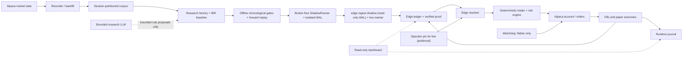

# Alpaca intraday trading agent

This repository is a research and execution skeleton for US equities, ETFs,
and listed OCC options through Alpaca. Paper mode is the default: collect
regular-session data, evaluate multiple strategy hypotheses and their variants,
and record every decision and fill for review. The supported universe is
US-listed equities/ETFs and listed OCC options only; crypto is rejected.
Options are single-leg long calls or puts
(buy-to-open, sell-to-close); multi-leg and naked/short option structures are
unsupported. No performance claim is made.

The current remediation state and evidence boundary are recorded in
[docs/trading-edge-remediation-2026-08-29.md](docs/trading-edge-remediation-2026-08-29.md).

## What this repository does

This is not an LLM that watches prices and improvises orders. It is a set of
separate, deliberately limited systems:

1. **Recorder and backfill** collect point-in-time market observations into an
   append-only, session-partitioned corpus.
2. **Research** searches a closed strategy grammar, simulates candidates, and
   applies chronological statistical gates.
3. **The edge ledger** stores candidate state, source evidence, proof hashes,
   and the exact parity-matched live-shadow run that authorizes deployment.
4. **The trader** resolves only proved ledger records, recomputes their
   deterministic signals, applies account-wide risk limits, and submits orders.
5. **State, journal, watchdog, and health services** reconcile broker truth,
   make retries idempotent, expose degraded conditions, and flatten when that
   can be done safely.



### How edge discovery works

The strategy factory normally runs twelve logical research slots, so a fresh
cycle can cover every bounded rule family. Each slot holds one hypothesis and
evaluates four isolated-account variants. It diagnoses only chronological fit
data, then judges the variants on untouched held-out data.
The twelfth family is `cross_sectional_residual`: a shares-only residual signal
against SPY built from synchronized one-minute context. It remains inside the
finite grammar and does not replace the shipped 24-ETF universe; any future
family or universe change must be justified by fit-only screen and
cross-sectional results.
Candidates are de-duplicated by their family-specific executable semantic
signature (including v1/v2/v3 no-op aliases). Continuous numeric axes use
relative/local scaling for semantic novelty, while integer/topology axes use
grammar-span scaling; exact signatures and validation are unchanged. A variant
is suppressed only after a powered upper-bound rejection; underpowered and
adequate-but-inconclusive results remain eligible for more evidence.
A candidate must clear structural trade/session floors, matched controls,
absolute after-cost profitability, falsification, fixed-rule rolling-origin
stability, and family-local plus cycle-global false-discovery correction. A
family can legitimately pass its local test but fail the global one; only the
global result can authorize cross-family selection. Historical and offline
forward screens do not spend cumulative alpha. The one durable online-FDR test
is reserved for the later parity-matched live-shadow tail.

The exit grammar remains fixed: an ATR-derived bracket (with the 30 bps minimum
stop floor), configured R target, and bounded bar-cap time exit. Factory
fit-only measurement reports eligible prefixes/first signals, 30-bps floor
binding, planned exits, gross/net/fees/slippage economics, power, configured
pre-cap versus fill-delivered risk, provider/feed provenance for each leg, pricing source,
configured limits, pass/fail/unknown row counts, behavioral aliases, and
aggregate fit-partition execution-rejection counts/reasons for operator review.
Before replay, the fit-only signal screen reports forward-return/control rows,
including `p=1` placeholders when a comparison is unavailable. A terminal
current-hypothesis no-edge result is explicit and reseeds when the corpus
changes. Target/hold path telemetry measures reachability only; lower-target and
hold proposals stay on a bounded ladder and cannot authorize an edge.
The cycle also records per-symbol/session bar coverage once per corpus and
distinguishes hold discontinuities from ordinary time expiry without assigning
a directional R effect; it is diagnostic only, does not expand exits, and
cannot authorize a candidate. Runtime order/trade state, the SQLite journal,
and the read-only dashboard separately retain configured pre-cap, full
post-cap planned, and fill-delivered risk plus their configured-budget ratios.
If every fit opportunity is explicitly execution-rejected, the fit is
`execution_blocked`, distinct from sparse/underpowered data; bounded budget
closure only progresses search exhaustion and is not a powered negative edge.

The authorizing floors are immutable: backtest/factory evidence requires 100
trades and 30 complete sessions/clusters; the sealed qualification window
requires 100 trades and 30 complete sessions/clusters; the parity-matched
live-shadow tail requires 150 trades and 30 complete sessions. Effective
breadth is persisted as a matched symbol/session correlation diagnostic, is
re-verified with the proof, and never counts as extra independent N. It is
separate from authorizing dependence: before a factory cycle, completed
prior-cycle family deltas are frozen into a hash-verified dependence map. When
that map has enough history, its family clusters receive a conservative
cluster-level BH veto in addition to family-local and cycle-global BH; the
cluster veto can only reject. Paper `selection_mode: all_proved` then admits
the strongest proved edge per verified frozen cluster. Families without a
verified assignment use the existing held-out correlation fallback and never
gain independence from missing data.

Serial inference is deterministic. Session/day-cluster deltas use a seeded
moving-block cluster bootstrap, with draw count, seed, and block length carried
in the evidence so the bound can be recomputed.

The final qualification sessions are sealed before the workers run. After
development ranking and correction preselect one candidate, that candidate
alone consumes the sealed window; other variants remain diagnostic. Candidate
and baseline observations, declared sessions, and content digests are bound
into the verified gate so the qualification decision can be recomputed.
A backtest pass is still not deployable. Offline historical or forward replay
may persist a passing `lane=shadow` candidate proof, but that status is
stability evidence only and never authorizes the runtime. A strictly newer
recorder tail must be evaluated by the broker-free ShadowRunner, then consumed
by `edge ingest-shadow` as a complete parity-matched proof before the candidate
can become `validated` or `champion`. An underpowered, mismatched, or incomplete
shadow cycle advances no durable boundary, so those sessions are reconsidered
when enough data exists instead of being silently consumed. Semantic or
mid-tail incompleteness is an intentional fail-closed quarantine, not permanent
loss; correct the source and run the bounded replay repair before retrying
ingestion. There is no unsafe auto-skip: unresolved quarantine blocks watermark
and FDR advancement until the repair completes.

The `shadow-confirmation-v5` live-shadow scope is independent and chronological:
each complete tail is split into an older selection window and a newer disjoint
confirmatory window. Batch BH uses selection p-values; only the selected
candidate's raw confirmatory p-value is sent to LORD++. With `W0=alpha`, its
first-discovery reward is zero and later discoveries receive the standard
`alpha` reward stream. Legacy v2/v3/v4 scopes remain audit-only and cannot
authorize under v5.

Within a hypothesis, refinement first changes exactly one executable field at
a time. Only after that coordinate neighborhood is measured can it combine two
of the best one-field values; a final unchanged confirmation follows before the
family can be replaced. Model-tuned proposals are held to the same one-field or
two-field contract, so a useful entry, exit, filter, or payoff parameter is not
discarded inside an unexplained bundle. For v2/v3 roots with measured
`min_atr_bps` and `stop_atr` coordinate lessons, an `execution_blocked` fit
diagnosis makes coordinate exhaustion schedule exactly one bounded measured
interaction. It uses configured stress geometry when available, never invents
missing values, changes no risk constants, and does not claim the pair will
trade.

When a slot proves an edge, the proved rule is frozen and the slot is reseeded
with a new hypothesis so research capacity does not shrink. Retirement requires
at least 100 executed trades in both fit and held-out partitions, at least 30
held-out sessions, a 95% clustered upper bound at or below the 0.05R minimum
useful edge, and at least two negative forward windows for every tested point.
A valid bounded replacement is registered first when enabled; a demoted
candidate may re-prove on a newer
shadow run and starts a new evidence epoch. Paper
`selection_mode: all_proved` can then select one strongest proved variant per
verified frozen dependence cluster under one global risk book and correlation
cap. Live paper
outcomes are scoped to the exact shadow proof that authorized the trade; if the
same candidate is later demoted, re-proved, and re-trialled, old outcomes do not
decide the new trial.

### How trading works

Every cycle begins with broker reconciliation and fresh clock, calendar, quote,
account, and position checks. The selected proved rule produces a deterministic
setup. The risk engine then decides whether it fits daily loss, open-risk,
position, liquidity, spread, buying-power, and marketable-limit constraints,
including the account-wide gross-exposure cap. Only after those checks does the
provider submit an idempotently named day order.

Equities use broker-side brackets. Long options are paper-only because Alpaca
does not provide an option stop order: the runtime rests a broker-side
take-profit, keeps the stop locally, and relies on the separate watchdog as a
stale-process backstop. Protective orders must be broker-confirmed canceled
before a local close is submitted. Startup, shutdown, force-flat, and crash
recovery all reconcile against broker state; an unreadable state file is a
blocking safety fault, never an empty book.

A trader process uses one execution profile (`shares` or `options`) at a time.
The market calendar is America/New_York (NYSE regular session), and production
replay requires the exact Alpaca calendar boundary for each session, including
early closes; it never promotes a missing day to a fixed 16:00 close. Entries
outside the session are rejected, orders are day-only, and positions are
force-closed before the broker calendar close. Research replay receives the
same runtime `ReplayPolicy`: `execution.strict_market_data` defaults to `true`,
with strict 30-second market/quote freshness, configured
DTE (default 7–60), option spread and liquidity checks, latest-entry and
force-flat cutoffs, and portfolio/risk limits (position count/notional,
gross/open risk, and daily loss) are all enforced rather than relaxed for
simulation. Point-in-time required records become actionable at the maximum of
their event timestamp, `as_of`, and `observed_at`. A delayed recorder bar can
signal when it is observed; execution enters at that decision/observation time
using fresh exact IEX or SIP (equity) or OPRA (option) evidence. Delayed full OHLC never
backfills an earlier entry, and partial pre-entry bar ranges are excluded.
Fit diagnostics may still count planned signal/exit geometry as
quote-required, non-authorizing measurement. Historical bar fallback remains
diagnostic and cannot authorize proof.
Authorizing fills retain provider/feed/age/source for both legs:
the equity lane must use the exact IEX or SIP feed for entry and exit, while
options require exact OPRA evidence, each no older than 30 seconds.
`delayed_sip` is diagnostic only and cannot authorize. Feed provenance is
request-bound: an explicit provider-row feed label is retained when present,
otherwise the configured/requested feed label is used; it is not an independent
venue attestation. Bar-only,
partial-feed, or stale legs cannot authorize proof.

The recorder runs on a fixed 30-second cadence and durably records per-symbol
quote and completed-bar watermarks. Readiness requires both watermarks to be no
older than 30 seconds for every required symbol; quote and bar readiness are not
substituted for one another. Exact Alpaca calendar metadata records holidays and
early closes explicitly. Scheduler service liveness is reported separately from
research evidence and readiness, so an alive scheduler does not imply a ready
corpus or a validated edge.

### Where the LLM is used

| Lane | What the model may do | What it cannot do |
| --- | --- | --- |
| Research | Propose a new bounded hypothesis, a replacement, or parameter values inside the validated rule grammar | Write executable strategy code, add data sources or indicators, skip a gate, validate a candidate, promote it, size it, or place an order |
| Optional paper runtime | Return a subtractive veto after the deterministic setup and risk prerequisites already exist | Create a setup, change side/quantity/price, bypass risk, or submit an order |
| Live runtime | Nothing; `llm.enabled: true` and injected decision brains are rejected | Participate in any live trading decision |

Research uses a bounded LLM proposal lane with a deterministic rule grammar.
Discovery, replacement, and tuning use strict full-schema structured
contracts (`additionalProperties: false`, including the complete rule
specification), and record schema/grammar hashes. The adapter enforces a
per-run total-call budget, per-call attempt/timeout/response bounds, and an
authentication circuit that stops further calls after an auth failure; result
evidence records call counts, circuit state, and each attempt's hashes/errors.
The optional paper-runtime call has a strict timeout. Empty or irrelevant
output means “no veto,” returning control to the already-audited deterministic
path; provider errors or malformed non-empty output veto that cycle. The LLM
never has broker authority. Proposal lessons and shared learning are fit-derived
only: underpowered or `execution_blocked` attempts do not count as family or
parameter successes/failures, and held-out/sealed/qualification evidence is not
shown to proposal generation. Model-authored novel tuning is capped at eight
numeric values per lineage/family in the durable factory ledger.

Custom provider endpoints are a trust boundary. `llm.base_url`,
`OPENAI_BASE_URL`, and `ANTHROPIC_BASE_URL` can receive the provider key and the
prompt, so configure only a trusted HTTPS service; the application does not
currently enforce a host allowlist for LLM endpoints. The OpenAI research path
uses the Responses API structured-output request. Prompt, request, schema,
configuration (including the effective sampling setting), and received-response
hashes make the evidence reproducible for the exact invocation, but they do not
guarantee bit-for-bit identical model output on a later call. OpenAI requests
send `temperature: 0` when supported; when the configured model or deployment
is exactly `gpt-5.6-terra`, the adapter omits that unsupported parameter and
records `temperature: null` in configuration evidence. Anthropic requests keep
`temperature` at `0`; the hashes preserve the actual request and response. The
adapter's call budget is a per-run call-count guard, not spend accounting;
provider-side quotas remain an operational control for unattended research.

Before any dataset work, the scheduled cycle runs one bounded, non-authorizing
`python3 research.py llm-preflight --agent-config config.yaml` probe through the
same provider path used by research. The provider model/deployment contract,
fatal versus degraded outcomes, and operator timing are documented in
[research/README.md](research/README.md#provider-preflight). The bounded,
redacted preflight result is retained in cycle/status/history and shown by
health/dashboard; transient `degraded` results keep deterministic fallback
available. If all later runtime LLM calls fail, the terminal status is
`llm_provider_failure` unless an authorizing proof already exists.

### Boundaries for future research extensions

The shipped 24-symbol ETF universe is an explicit operator-approved expansion;
any later universe change still requires an exact symbol list, recorder coverage
for that list, and a new identity/proof. Event conditioning requires a
point-in-time event source with its own provider, `as_of`, and observation
provenance. Prior-session, true multi-timeframe, and cross-sectional features
require explicit context in the replay input; missing or ambiguous context fails
closed. Shadow quarantine is not an auto-skip: an unresolved quarantined session
blocks watermark/FDR advancement until its source is corrected and the bounded
parity replay completes.

### Costs and authorization checks

The shared vehicle-specific cost model uses explicit `costs.vehicles.equity` or
`.option` schedules when configured (with provenance); otherwise the shipped
defaults are 4 bps spread, 6 bps adverse slippage, and 0.5 bps per-side
notional fee, plus a 0.65 currency-unit listed-option fee per contract per side.
Proofs also persist preregistered all-in stress scenarios of
9, 15, 25, and 50 bps; the 25 bps scenario is the required authorization
check, while the others are diagnostics. Runtime rejection caps are separate
from expected costs. Stress applies the scenario bps to entry notional and then
adds listed-option round-trip fees for both per-contract sides; it is not a
per-side bps charge. The shipped `max_stressed_cost_to_risk_ratio` is `0.30`.
Runtime, factory, explicit IBR, and randomized-null quote-entry replays share
one pure entry-slippage cap; malformed inputs use `entry_slippage_invalid`,
and over-cap quotes use `entry_slippage_exceeds_limit` as stable
refusal/no-trade reasons. This cap is separate from expected costs.
For a 30-bps-floor trade, 25 bps of entry-notional stress is about `0.833` of
risk, so the trade is vetoed by that limit before any option fees.

`research.py calibrate` reads the journal without mutation and checks entry and
exit fills independently per vehicle; equity and option calibration is never
pooled. Runtime risk applies the configured stressed-cost scenario (25 bps by
default) and abstains when `stressed_cost_to_risk_ratio` exceeds
`max_stressed_cost_to_risk_ratio`; intended,
delivered, ratio, and shortfall telemetry are persisted with orders and fills.
The scheduled calibration-only pass measures each symbol/session on the
9/15/25/50-bps ladder. It is disabled by default and can affect runtime only
through an explicit operator-enabled path whose artifact carries the exact
provider/feed, content hash, disjoint chronological held-out sessions, and an
artifact-wide effective-after boundary. Missing or unusable cells use the
configured scalar fallback; calibration never self-authorizes.
Shadow authorization fails closed when the journal is
missing or stale, the sample is insufficient, costs are optimistic, a terminal
fill is materially underfilled (<80% of requested quantity), or the
partial-cancel rate exceeds 20%. Offline discovery and factory diagnostics may
continue, but no shadow proof is ingested until calibration is fresh and
authorized. In-flight orders are excluded, and partial fills are measured from
plan/reference fields rather than realized notional. The model is never
adjusted automatically.

## How an edge reaches money

Four states, and only one transition a machine cannot make.

| State | Who decides | Can it change on its own? |
| --- | --- | --- |
| **Research** — hypotheses, variants, gates | the factory | yes, continuously |
| **Proved** — `validated`/`champion` plus a live-shadow marker | the gates and live ingestion | yes, on evidence |
| **Trial** — trading the same Alpaca paper account, with outcomes scoped to its authorizing shadow proof | automatic | yes: a trial below its floor is parked and its failure becomes a lesson |
| **Pinned** — an id you wrote into `config.yaml` | **you only** | **yes, on a sequential drift or trial stop; rolling-R is advisory, the pin context is retained, and no replacement is auto-selected** |

Promotion is the one step that is never automatic. When an edge clears its
trial, `research.py edge promotable` names the variant, shows what it actually
returned on the book, and prints the exact configuration block:

```bash
./.venv/bin/python research.py edge promotable
```

```json
{ "strategy": { "selection_mode": "pinned", "pinned": [
    { "id": "pin-equity-abc12345",
      "variant_id": "rule.opening-range-breakout.abc12345…",
      "vehicle": "equity", "strategy_id": "rule",
      "promoted_at": "2026-08-12",
      "note": "live paper: 34 trades over 21 sessions, total R 6.40" } ] } }
```

Paste it, restart the trader, and the pin records the operator's selected
identity and promotion context. Pinning does not exempt the edge from the
sequential drift stop or trial review: an authoritative breach still parks or
demotes it and runtime selection fails closed, with the pin context retained
for audit. The rolling-R monitor remains visible but advisory. Pinning selects,
it never authorizes — a pinned entry still has to
resolve to a proved ledger record with a re-verified passing proof, so an id in
a file cannot put an unproved variant on the book. A pin that cannot resolve is
reported rather than silently substituted.

Manual `edge promote` and offline replay cannot manufacture the live-shadow
marker. A legacy `validated` or `champion` row without that marker may be
evaluated by the live lane and migrated by `edge ingest-shadow`, but remains
ineligible until a new authorized parity-matched proof is appended.

Every `id` is yours and must be unique; it is the handle the audit trail, the
dashboard, and the notifications all use. Separately, every distinct
configuration the runtime loads is recorded with a content-addressed
`config_version_id` and a diff naming each field that moved, so any changed
value is traceable to a version, a time, and an actor. Secrets are recorded as
having changed, never as values. A configuration-audit write failure does not
halt a trader that may already own exposure; instead, the runtime keeps a
sticky degraded heartbeat with reason `config_audit_unavailable` until a later
successful audit clears it.

## Safety boundary

- Paper mode (`mode: paper`, `broker.paper: true`, `ALPACA_PAPER=true`) and
  Alpaca's paper endpoint are the documented defaults.
- Live mode is an explicit, separately reviewed configuration only: set
  `mode: live`, `broker.paper: false`, `broker.allow_live: true`, and
  `ALPACA_LIVE_ENABLE=true`; then either `strategy.selection_mode: pinned`
  with exactly one `strategy.pinned` entry, or `strategy.selection_mode:
  specific` with one exact named validated/champion `strategy.variant_id` whose
  latest shadow proof carries the live-ingestion marker.
  Prefer `pinned`: it carries an operator-assigned promotion id, so the audit
  trail can name who deployed the edge and when. Live mode pins that edge and
  does not auto-switch. Keep live configuration, credentials, and
  `ALPACA_AGENT_RUNTIME_ROOT` in a separate runtime scope from paper.
- `strategy.execution_mode: options` is paper-only. Alpaca offers no bracket,
  OCO, or stop order on options, so an option position's protective stop is
  software (the 60-second poller, bounded by the separate `watchdog` process)
  and `mode: live` rejects the options profile. If the broker or network is
  unreachable, nothing local protects an open option position.
- `mode: live` rejects `llm.enabled: true`. The validated edge was proven with
  the deterministic rule and no LLM in the loop, so enabling the runtime LLM
  veto in live would deploy a strategy that is not the one that passed the
  gates. Runtime decision LLM use stays off; the bounded research replacement
  adapter is a separate, offline setting.
- Keep API keys in `.env` or a host secret; never commit them. Use trading
  permissions only and disable withdrawals.
- Research, recorder, trader, and dashboard state is isolated in named
  volumes. Runtime entries require a vehicle-local `validated` or `champion`
  edge record whose latest shadow proof carries the research-side
  parity-matched live-ingestion marker; research cannot place orders or mutate
  broker state. A live preflight additionally requires the account to report
  `pattern_day_trader=true`.

The source and tests are the behavioural authority. [SETUP.md](SETUP.md) is
the installation authority, [OPERATIONS.md](OPERATIONS.md) is the runbook, and
the files under `research/` describe evidence collection. Prose must not be
read as a performance claim.

## Architecture

For the detailed process, module, state, research, execution, safety, and
decomposition map, see [ARCHITECTURE.md](ARCHITECTURE.md).

`agent/alpaca_provider.py` is the small boundary around `alpaca-py`. It
normalizes account, asset, quote/bar, calendar, option-chain, order, and trade
update data for the rest of the application. `agent/alpaca_session.py` owns
the NYSE calendar and session policy. `agent/contracts/rule.py` is the safe
strategy grammar shared by research and runtime; generated specifications can
never contain executable code. It has three versions: `rule-strategy.v1` is
unchanged and keeps every existing variant id, `rule-strategy.v2` is a strict
superset adding entry-side predicates only — a multi-filter confirmation list,
a session-time entry window, and an ATR volatility band — and
`rule-strategy.v3` adds nullable numeric `breakeven_r` for equity shares.
Options remain on executable v1/v2 schemas; a v3 root stays v3 while tuning.
V2 entry predicates do not reach sizing or execution; v3 affects only the shared
bounded breakeven stop-transition path and cannot author arbitrary orders.
`agent/contracts/ibr.py` remains the explicit
IBR replay/baseline. Risk and execution
profiles enforce sizing, single-leg long-option checks, idempotent client
order IDs, and end-of-day flattening.

The lean deployment topology is:

| Service | Responsibility | Durable state |
| --- | --- | --- |
| `recorder` | Alpaca bars, quotes, and option snapshots (paper by default) | `runtime-data` |
| `trader` | One paper intraday decision loop in the shipped `shares` execution profile; no overnight book | `runtime-data` |
| `research` | Scheduled offline replay, evidence, reports, and shadow-WAL ingestion | `runtime-data`, research volumes |
| `shadow` | Broker-free virtual evaluation and semantic replay parity | Read-only recorder/EdgeLedger inputs, isolated WAL |
| `dashboard` | Read-only localhost health and reports | Read-only mounts |

The plain supported Compose deployment starts offline research, the broker-free
shadow service, and default shadow-WAL ingestion in the default startup. A fresh
deployment must run these lanes long enough to produce a live-shadow-marked
champion before the trader can open risk. It
consumes the recorder's mixed corpus (bars, quotes, and option snapshots),
which is written one append-only partition per New York session date under
`runtime/research/recorded/sessions/` with a sidecar index; the cycle script
concatenates those partitions in session order.
`ALPACA_RESEARCH_SESSION_WINDOW` limits it to the most recent N sessions and
`ALPACA_RESEARCH_DATASET` overrides the source with normalized JSONL. By default
each cycle schedules twelve logical strategy slots and four isolated accounts
per strategy. Each isolated book is processed by one bounded worker. Its
edge-lab and factory lineage are kept in the SQLite ledger
at `runtime/research/edge_lab.sqlite3`; the dashboard only observes ledger
status, latest re-verified passing edges, per-edge live paper results, edge
proof reports, and the execution journal.

The Compose `shadow` service reads the recorder corpus and EdgeLedger read-only,
has no broker credentials, and writes only its isolated shadow WAL.
It evaluates eligible candidates in isolated virtual books from recorder events,
creates exact-session candidate, paired synthetic root-control, and
randomized-null replays, and quarantines mismatch/incomplete rows. The paired
root-control arm consumes the same events in its own virtual book; it is shadow
evidence, not an EdgeLedger lifecycle record. It compares semantic
runtime-shadow signatures with factory/IBR replay and has no order or broker
authority.
Verified gate envelopes also retain per-arm candidate, baseline, and null counts,
fill sources, quote ages, gross/cost/net economics, matched and dropped keys,
and directional/pair coverage. A denser or sparser quote corpus can therefore
change null/control evidence even when the candidate count is unchanged.

The read-only dashboard (`http://127.0.0.1:8080`) is the detailed reporting
surface. Beyond trader health it shows: paper-account trials with each edge's live
record against its floor; promotable edges with the config block to paste;
pinned promotions and any pin that cannot currently trade; every recorded fill
attributed to the strategy and variant that placed it, plus a per-variant
roll-up of what the broker actually did; the graded reason history with what
each proposal built on; and the configuration audit trail. It is read-only —
`POST` returns 405 — and nothing on it can change a lifecycle.

The CLI answers the same questions without a browser:

```bash
python research.py edge promotable          # what has earned a promotion
python research.py edge trials --dry-run    # what a trial review would do
python research.py edge paper --deployed    # how each deployed edge is doing
python research.py factory report           # the full discovery narrative
```

The standalone `research.py factory run` (or `factory-run`) preflight requires
readable normalized JSONL with explicit provenance; the equity lane requires
exact IEX or SIP. `delayed_sip` is diagnostic-only. `--diagnostic-only` is the
explicit non-authorizing escape hatch:
it records the source as diagnostic and emits no proofs.

Three read-only views answer three different questions, and none can change a
lifecycle state:

- **What is research doing?** `research.py factory report` renders the full
  discovery narrative — every slot, every hypothesis it has held, who proposed
  each one and on what rationale, every variant with the reason it was tried,
  its performance and the named gates it missed, why anything was retired and
  after how many variants, and the graded reason history: what was tried, why,
  and what the gates then said. `--format markdown` produces a shareable
  document. Each cycle archives it under `research/results/factory/`, so the
  dashboard lists it without anyone running a command.
- **What evidence was an edge promoted on?** `research.py edge status` and the
  dashboard's "Proved edges" table.
- **What has it done since?** `research.py edge paper` and the dashboard's
  "Live paper results by edge" table — trades, sessions, total and mean R, win
  rate, net P&L, the advisory rolling-R monitor, and the sequential drift
  statistic against its validated held-out distribution.

## Quick start

```bash
python3.12 -m venv .venv
./.venv/bin/python -m pip install -r requirements.lock.txt
cp .env.example .env
chmod 600 .env
./.venv/bin/python main.py check --offline
./.venv/bin/python main.py check
./.venv/bin/python research.py edge status
./.venv/bin/python research.py factory status
./.venv/bin/python main.py run
```

Set `ALPACA_API_KEY`, `ALPACA_SECRET_KEY`, `ALPACA_PAPER=true`, and the
free Basic IEX equity feed in the broker secret. The shipped universe is
equity-only and options acquisition is disabled; configure OPRA only for an
explicit option-lane review. IEX is a limited venue view rather than the
consolidated SIP tape; sparse coverage is retained as evidence, and changing
feeds requires a fresh research/shadow proof. The scheduled research lane also
requires a separate readable dotenv file with `OPENAI_API_KEY` for the checked
`openai`/`gpt-5.6-terra` provider (or the matching configured provider key); set
`ALPACA_RESEARCH_LLM_SECRET_FILE` to that path. Azure endpoints additionally
require the exact resource-local alias in
`research.strategy_llm.deployment`; do not substitute a catalog model ID.
Do not put provider keys in the
broker secret. `check` is the
authenticated preflight by default; `check --offline` validates local
configuration only and is not a trading preflight. Unit tests use fakes and do
not need credentials. Research LLM discovery/replacement/tuning is enabled with
the checked `openai`/`gpt-5.6-terra` provider and fails closed before discovery when its
separate secret is absent, unreadable, or keyless. Provider credentials are
read only from `ALPACA_RESEARCH_LLM_SECRET_FILE`; invalid model output leaves a
pending replacement and never retires a family or authorizes trading.
Runtime decision LLM use is hard-off in the paper trader. The default trader
remains paper-only with the `shares` execution profile; scheduled research
therefore runs the equity vehicle only by default. Set
`ALPACA_RESEARCH_VEHICLES=all` explicitly to run equity and option research
independently; each vehicle keeps its own calibration and authorization
evidence, and option research does not enable option execution. Seed months of
history in one command instead of waiting for the recorder to accumulate it:

For the plain supported Compose deployment, first provide both credential
paths, then start every paper service (including scheduled research and the
broker-free shadow lane):

```bash
export ALPACA_AGENT_SECRET_FILE=/etc/alpaca-agent-trading/agent.env
export ALPACA_RESEARCH_LLM_SECRET_FILE=/etc/alpaca-agent-trading/research-llm.env
docker compose config --quiet
docker compose up -d
docker compose ps
```

The broker secret must contain the Alpaca paper key/secret; the separate
research secret must be readable and contain the configured provider key.
Compose refuses to render the research service when that provider path is
missing or unreadable.

```bash
./.venv/bin/python deploy/backfill.py --days 180
```

Backfill writes the recorder's normalized partitions and index, but labels each
partition `source_mode: historical_backfill` and retains exact Alpaca calendar
open/close metadata (including early closes). Its fetch-time `observed_at` is
not backdated. Historical rows may be inspected only through the explicit
diagnostic replay policy and are marked `diagnostic_historical_backfill`; they
are never authorizing evidence or a live-shadow authorization. Options are not
backfilled and still need recorded sessions. The shipped default universe is
24 liquid ETFs spanning broad-market, size, sector, international, rates/credit,
metals, and semiconductor exposures (the exact list is in `config.yaml`).
This improves opportunity capacity, but real signal rates still require
sufficient history. Floor
feasibility fails closed when the 100-trade held-out floor cannot be met;
widen the history and/or `universe.symbols`, never lower the evidence floor. On a
fresh ledger, `run` starts safely but will not submit entries: first collect an
initial corpus, let offline research pass its backtest/forward prerequisites,
then run the broker-free ShadowRunner and the research-side `edge ingest-shadow`
on a strictly newer recorder tail. Only that complete parity-matched live proof
can authorize validation/champion selection. This delay is an intentional
evidence gate, not a startup error.

Backtest/factory evidence requires 100 trades plus 30 complete sessions/clusters;
sealed qualification requires 100 trades plus 30 complete sessions/clusters;
and the parity-matched shadow tail requires 150 trades plus 30 complete
sessions. Replay epoch 5 retains the epoch-4 point-in-time, executable-row,
vehicle-cost, raw-confirmatory-p, and stressed-cost boundaries, and additionally
seals paired synthetic root-control shadow decisions/replays, diagnostic-only
historical-backfill provenance with exact calendar metadata, durable live-shadow
FDR allocation binding, chronological paired inference, finite BH input
validation, and conservative broker-tick equity rounding. Epoch-4 proofs remain
readable for audit but cannot validate, champion, or authorize the trader; they
must be re-derived under epoch 5. Authorization requires exact equality with
current epoch 5, while future epochs are audit-only. Each current-epoch run
seals one immutable verified gate proof, and re-derivation appends a new proof
rather than rewriting history.

For Docker or an Azure VM, follow [SETUP.md](SETUP.md). For backups,
reconciliation, session-close checks, and recovery, follow
[OPERATIONS.md](OPERATIONS.md). A paused-runtime recovery uses the
authenticated, flat-only `main.py resume` command described there;
[AZURE_DEPLOYMENT.md](AZURE_DEPLOYMENT.md) covers the Azure-specific work that
precedes SETUP.md: attaching and mounting a managed data disk, pointing Docker
at it so the edge ledger is durable, and closing the network security group.

## Verification

```bash
./.venv/bin/python -m compileall -q agent deploy main.py research.py
./.venv/bin/python -m unittest discover -v
docker compose config --quiet
docker compose build
```

Treat a failing safety, session, mode-boundary, or no-overnight test as a
release blocker. Root discovery includes the deployment and research suites.

## What is deliberately not included

There is no overnight strategy, withdrawal flow, default unattended live
deployment, multi-leg/naked option path, crypto path, or assertion that any
generated signal has positive expectancy. Any live launch requires a separate
reviewed config/runtime scope, provider guard, named edge, risk policy,
session-close behaviour, tests, and operational controls.
