# Trading edge and research audit

This is the pre-remediation audit of the pinned revisions below. For implemented changes and remaining work, read [the remediation record](trading-edge-remediation-2026-09-07.md) and [the handover](trading-edge-handover-2026-09-08.md).

**Audit date:** 7 September 2026, Dubai. Initial deployment observations were collected around 21:15–21:20 UTC on 6 September; container state and the orphan partition were rechecked at 04:23 UTC on 7 September. Branch tips were rechecked at 04:30 UTC. **Verdict: a substantial research and execution scaffold, but no demonstrated deployable positive edge in the evidence inspected.** Main improves research integrity, but neither audited revision is ready to be trusted as a profitable day-trading product.

The highest-value next work is to restore forward data collection, correct accounting and protection defects, and run a small, frozen set of economically motivated experiments. Increasing variant count, loosening risk limits, or adding research containers alone does not address the observed failures.

## Scope and branch identity

I mapped the repository, traced the signal → setup → risk → fill → exit → journal → research → promotion paths, inspected the twelve rule families and versioned parameter grammar, examined tests, and then compared the implementation with the Markdown claims. I also read existing deployment status, logs, ledgers, and historical variant reports. This is an economic and end-to-end engineering audit, not a claim that every line received a separate formal review.

| Order | Revision audited | What it actually contains |
|---|---|---|
| 1 | Latest non-main branch, `claude/trading-system-edge-review-yhxgbq`, **cdef4aac22f124265e4f387f337bba4f9a6ce8da** | Two September 4 review documents on top of common base `6988bdc`; no functional changes beyond that base |
| 2 | Main, **958da0c2b8a8638c8d85e9562187b0c3189a3683** | Two subsequent functional commits: paper promotion changes and measured-cost/epoch binding |
| Separate observation | Running deployment reports build **598731b6eca075587d0505ef55c0306a3def2073**; host checkout was **38b23cf** | Neither audited branch tip was the running image. Historical results must not be attributed to either tip |

Remote branch heads were checked directly. The branches **diverge from `6988bdc`**; main is not a descendant of the September 4 review branch. Code was inspected in frozen [latest](https://github.com/khanalyst/alpaca-trading/tree/cdef4aac22f124265e4f387f337bba4f9a6ce8da) and [main](https://github.com/khanalyst/alpaca-trading/tree/958da0c2b8a8638c8d85e9562187b0c3189a3683) snapshots. Source links below are pinned to the audited commits; raw probe artifacts remain in the local evidence directory listed in the handover. No tracked source, trading configuration, deployment, orders, or positions were changed.

## 1. Latest branch: trader and independent engineering assessment

### What is good

This is more than a collection of indicator scripts. It has causal completed-bar rules shared across research and runtime, bounded strategy proposals, explicit cost and risk checks, session-aware execution, broker reconciliation, chronological evidence partitions, null controls, multiple-testing controls, and a broker-free shadow lane. Those mechanisms are useful for rejecting false discoveries.

The implementation also already supports versioned exit management. A claim that the product has no trade management is inaccurate: fixed stops/targets, time exits, breakeven, trailing stops, and VWAP/rolling-mean targets exist. Whether a particular stored variant enables them is a separate question. [Signal contract][rules]; [exit evaluator][exits].

### Material findings on latest

| Priority | Finding | Trading consequence | Evidence |
|---|---|---|---|
| P1 | Partial close reconciliation loses original quantity and can retain an earlier fill price | Realized P&L, cost calibration, R multiples, and subsequent learning can be wrong | Reproduced on both revisions; details below |
| P1 | Account daily-loss evaluation occurs after entry/proof gates | An existing position can remain open without the portfolio daily-loss cap being evaluated after the entry cutoff or when proof eligibility changes | Reproduced on both revisions |
| P1 | One valid orphan calendar marker makes the recorder reject its partition calendar scan | Fresh observations stop arriving; future proof cannot accumulate | Reproduced on both revisions and matched to the deployment error |
| P1 | User-facing P&L and win-rate paths use a gross column despite an explicit net column | A net loser can appear as a winning trade | Reproduced on both revisions |
| P1 for research interpretation | Stress feasibility silently widens authored stops and recalculates fixed-R targets | The evaluated trade can have materially different exits from the proposed hypothesis | Latest-specific behavior; main changes this |
| P2 | Candidate selection and position allocation do not constitute a portfolio of independent economic bets | Several ETF positions can express the same market/sector exposure; a selected candidate may have no current signal | Allocation code and fixed universe |
| P2 | Research can produce little new evidence while processing large historical artifacts | Elapsed runtime and proposal counts can be mistaken for learning progress | Actual deployment evidence below |

**Partial-fill reproduction.** A position enters 10 shares at $100. A close order first reports a cumulative fill of 4 shares at $101, while the position endpoint reports 6 remaining shares. The same order later reports a complete cumulative fill of 10 shares at an average $102 and the position disappears. Both revisions journal **6 shares at $101, gross P&L +$6**, instead of **10 shares at $102, gross P&L +$20**. Reconciliation overwrites active quantity with residual quantity, prefers cached closing price, and later clamps cumulative close quantity to that residual. This is a broker lifecycle defect even though intentional strategy scale-outs are not supported. [Reconciliation][partial-code]; [exact evidence][partial-proof].

**Daily-loss reproduction.** At 15:30 New York time, before the usual 15:50 flatten, the 15:00 entry cutoff returns before account retrieval and `_update_daily_risk`. A failed proof refresh produces the same ordering. In both controlled probes, account calls, daily-risk calls, and daily-loss flatten calls were all zero despite an existing position and a breached-loss scenario. Position-level monitoring runs earlier and broker brackets can still protect equities; the specific failure is omission of the **account-level** daily cap on these paths. [Cycle ordering][cycle]; [probe results][parent-probe].

**Gross/net reproduction.** A journal close with gross +$0.05 and net −$0.05 appears in the summary as a winner with +$0.05 realized P&L and 100% win rate. Its percentage P&L is negative, exposing inconsistent semantics in the same result. Execution intentionally stores gross in legacy `realized_pnl_usd` and net separately; the report selects only the former. Dashboard journal and by-variant views inherit this problem. By-variant calculations also use the default latest 200 journal rows and count fill rows as “trades,” so they are not a lifetime closed-trade scorecard. [Writer][pnl-writer]; [report][pnl-report]; [dashboard][dashboard-trades].

**Stress geometry.** With a 25 bps stress scenario and maximum cost/risk of 0.30, required distance is approximately **83.33 bps**. Latest can widen an authored stop to this requirement and move a fixed 2R target to approximately **166.67 bps**. This changes target reachability, holding-time distribution, and risk-normalized results. The ordinary 30 bps rule floor is a separate mechanism and remains on both branches. [Latest stress transformation][latest-geometry].

### Trader judgment on latest

The tool can test a defined intraday hypothesis, but it has not shown that its hypotheses identify a repeatable source of buying/selling pressure after costs. Most families reuse the same one-minute OHLCV information. Naming a rule “momentum,” “VWAP,” or “residual” is not evidence that its entry timing adds value.

Its strongest capability is disciplined rejection. Its weakest demonstrated capabilities are continuous acquisition of usable market observations, reliable economic feedback, and converting a market mechanism into a sufficiently distinct signal. The accounting and protection defects mean even a promising paper result would need reconciliation before being trusted.

## 2. Main branch: improvements and remaining limitations

Main is the better implementation baseline for remediation. Its changes improve the meaning and provenance of results; they do not establish profitability.

| Area | Latest | Main | Assessment |
|---|---|---|---|
| Stressed stop geometry | Can widen stop and recompute fixed-R target | Rejects with `stressed_cost_risk_limit` when required stress distance exceeds authored distance | Main preserves the hypothesis being tested; still may admit very few signals |
| Measured cost assumptions | Weaker binding across the reviewed proof path | Enabled measured schedules and provider identity enter candidate assumptions; proof verification resolves row economics against the frozen schedule | Material integrity improvement |
| Cost resolution | Static paths dominate | Context-specific entry and exit model resolution, strict missing-cell refusal, row-level economics | Useful, provided schedule inputs and execution assumptions are credible |
| Evidence reuse | Less complete separation under changed assumptions | Learning and paper evidence are scoped more tightly to their governing assumptions/proof | Prevents treating incompatible old results as current evidence |
| Default paper selection | `all_proved` | `specific` with `variant_id: auto` | More focused default; explicit multi-edge selection remains available |
| Measured economics enabled by default | No | **No** | Shipping the mechanism is different from calibrating the deployment |
| Four reproduced defects above | Present | **Still present** | Must be fixed before interpreting new economic results |

Main’s [risk admission][main-risk], [candidate assumptions][identity], [proof verification][proof], [measured resolver][measured], and [configuration][config] support these distinctions. The latest measured-cost/epoch changes were not running on the observed host, so they cannot explain or validate its current results.

The new live-paper trial check requires at least 30 sessions and 100 outcomes, then checks positive mean R and total R. That is a useful operating milestone, but at this stage it is a **positive point estimate**, not a new confidence-bound proof of edge. Earlier research qualification has substantially stronger checks; this criticism must not be generalized to the entire gate system. Also, `return_pct` is computed as `100 × total_R / trade_count`, effectively mean R expressed as a percentage. It is neither account return nor, with unequal trade risks, aggregate P&L divided by aggregate dollars risked. Rename it and show actual capital return separately. [Trial checks and return calculation][trial].

The measured quote model is still a model: its additional impact estimate depends on order size relative to observed touch depth, capped in half-spreads. It does not demonstrate calibrated adverse selection, queue behavior, or decision-to-fill latency. At sizes within the chosen depth it can estimate no additional impact. That is a hypothesis to validate against fills, not an empirically proved zero-cost execution claim. [Impact calculation][impact].

## 3. What the deployment and historical results actually show

### Current operational state

| Observation | Evidence and meaning |
|---|---|
| Four running containers | Shadow and dashboard were healthy; recorder and the direct diagnostic research container were unhealthy. No trader or watchdog container was running in the observed container list |
| Trader state | Locally persisted state was operator-paused. The heartbeat was stale. This inspection did not query the broker account directly and does not certify that it was flat |
| Current research ledger | 7 registered candidates; **0 runs, 0 recorded research trades, 0 evidence rows, 0 paper outcomes** |
| Factory bookkeeping | 24 hypotheses, 120 lesson records, but **0 graded lesson outcomes**; two recorded cycles both reported `llm_all_calls_failed` and zero executed variants |
| Paper journal | **0 order rows and 0 trade rows**. Operational events and equity samples exist, but they are not a trading track record |
| Recorder | 137 corpus partitions reported; all observed partition source modes were historical backfill. Count is not 137 forward-observed trading sessions |
| Freshness failure | The last market observation watermark was September 3. The recurring error named the September 4 calendar marker; that marker existed while its CSV partition did not |
| Calibration | `bootstrap_unknown`, insufficient data, 0 journal fills. No demonstrated fill-based cost calibration |

Sources: [deployment snapshot][host-snapshot], [dashboard status][host-status], [read-only ledger and file evidence][host-evidence]. The calendar scan rejects a marker without its corresponding partition, although the research dataset reader explicitly skips that harmless crash-window orphan. This is a concrete consistency defect. A weekend can explain market inactivity, but not repeated marker-validation errors. [Recorder][recorder-marker]; [dataset handling][dataset-marker]; [main reproduction][orphan-proof].

The active direct factory process had been running for about 51 hours at the earlier process sample, with approximately one CPU fully occupied. Its input market JSONL was **51.98 GB**, containing approximately **124.77 million quotes** and **381,228 bars**. Validation took about 4 hours 21 minutes, and the baseline backtest another 5 hours 48 minutes. The factory output file was still empty at inspection. CPU activity is not evidence of a deadlock, but the execution path is too slow and too opaque for an effective intraday research feedback loop. Its preprocessing cache reported `immutable_source_identity_unavailable`.

The dashboard scheduler record was stale and referred to a different earlier job. The active container invoked the cycle directly. Therefore the old scheduler status is not reliable evidence of what this process was doing. Progress should identify the exact active process, image, dataset, phase, observations processed, and last completed result. [Current diagnostic log][host-log].

### Available historical performance

These are saved diagnostics from **older builds**, not a new backtest of either audited tip. They are valuable evidence about the reported failure pattern, but cannot authorize current code.

| Historical experiment | Executed variant-trades | Gross P&L | Net P&L | Interpretation |
|---|---:|---:|---:|---|
| August 28, 44-variant baseline | 650 | −$28,148.83 | −$29,748.81 | 20 variants traded and were negative; 24 had zero trades; none positive |
| Same diagnostic cohort, stress ratio relaxed from 0.30 to 0.60 | 746 | −$30,535.99 | −$32,371.32 | More admitted trades, still negative before costs |
| August 25 alternative stress arm | 513 | Not supplied in extracted summary | −$33,039.82 | Baseline had zero executions; relaxing feasibility did not establish positive edge |
| August 29 factory, 44 variants | 0 | No executions | $0 | An admission/data/research failure, not 44 measured losing strategies |
| September 4 completed IBR baseline diagnostic | 878 | −$431.00 | −$458.63 | Different baseline and sizing; also negative before costs |

**Do not read the pooled dollar totals as one account’s loss.** Factory variants use isolated simulated accounts; related trades and sessions overlap. The sum is a descriptive cohort result, not a deployable portfolio or a set of independent observations. Changing admission also changes subsequent portfolio availability, so the P&L difference is not an isolated causal estimate of the risk-limit change. The IBR totals use a different simulator/sizing context and are not comparable account returns. [All extracted metrics][historical]; [current baseline log][host-log].

Correction from the retained raw summary: the August 28 baseline's **$1,599.98051614259** figure is fees alone, or about **5.38% of the $29,748.81317868 net loss magnitude**; it is not total modeled cost. The reported **−$28,148.83266254 gross P&L already uses modeled execution prices**. Reconstructing the reference-price result from 650 trades at mean `−$3.9217631318679436` gives **−$2,549.146035714163**, with **$25,599.68662682753** of modeled execution drag; execution drag plus fees therefore explain about **91.4311%** of the net loss, while reference-price P&L remains negative. These are simulated bar-fill decompositions, not actual-fill calibration, and do not justify loosening assumptions. The preserved exit observations remain **514 time exits (79.1%), 90 stops (13.8%), and 46 targets (7.1%)**; the old “time” category still does not reliably separate thesis expiry, session truncation, and every data-continuity circumstance.

The same baseline recorded **32,277 `no_contiguous_feature_window` refusals** among 44,352 terminal opportunity rows, and 11,300 `no_signal` rows. On August 29, all 44 variants had no executions, with **32,441 stressed-cost refusals** in the extracted variant diagnostics. Many were labeled `insufficient_signals`, which obscures the distinction between absence of an entry predicate and refusal of an otherwise generated opportunity. The older discovery records also report an 8,192-byte aggregate-context rejection. These are separate failure modes that should not be pooled under “negative edge.”

The [variant appendix][variants] includes all 44 variants from each of the two saved factory cohorts, their exact persisted parameter sets, trade counts, net P&L, win rates, and exits. The older cohorts cover eleven families; they do not provide a measured result for the newer cross-sectional residual family.

## 4. Signals, entries, exits, and values through a day trader’s lens

All twelve implemented families use completed **one-minute bars**. The table describes the factory templates, not guaranteed trading start times: missing bars, confirmations, entry windows, and execution gates can delay or eliminate a signal. [Templates][templates]; [causal dependencies][dependencies]; [predicates][predicates].

| Family | Template / minimum completed bars | What must be demonstrated economically |
|---|---|---|
| Opening range breakout | 15-minute range, volume confirmation / 16 | Breakout continuation conditional on gap, opening auction context, range width, relative activity, market direction, and time remaining |
| Opening range fade | 20-minute range / 21 | Genuine rejection back into value; avoid fading strong trend or catalyst sessions merely because price is extended |
| Momentum continuation | Lookback 12, volume / 15 | Forward continuation survives next-quote entry and costs; distinguish early initiative from exhaustion |
| Mean reversion | Lookback 20, volatility / 20 | A defensible value anchor and mean-reverting regime; a z-score alone does not establish either |
| Trend pullback | Lookback 10, slow 35, trend / 35 | A prior trend and completed pullback structure. Current predicate includes close versus current candle open; that is weaker than a swing-based pullback definition |
| Volatility breakout | Lookback 12, volume / 15 | Compression precedes directional expansion with room to move after entry |
| Volume breakout | Lookback 15, trend / 40 | Volume is unusual for that symbol and minute of the session, not merely larger than adjacent bars |
| VWAP reversion | Lookback 20 / 21 | Session VWAP is a credible fair-value reference; residual distance exceeds execution costs and adverse excursion |
| VWAP trend | Lookback 15, volume / 16 | Acceptance on one side of value plus sustained directional pressure; separate from nearly identical momentum exposures |
| Range expansion | Lookback 20 / 21 | Expansion predicts continuation rather than marking the end of the move |
| Opening drive | 30-minute range, volume / 31 | Enough continuation remains after observing the opening drive; first signal timing is central |
| Cross-sectional residual | Lookback 15 / 16, synchronized SPY | Relative performance contains information beyond market/sector beta and shared news; current execution is single-leg directional equity |

Cross-sectional residual is explicitly **not market-neutral**. It subtracts SPY return, not an estimated beta-adjusted factor model, and has no hedge leg. Its fallback eligible set has 19 equity ETFs and excludes SPY and non-equity comparators such as GLD. It should be judged as a relative-strength or relative-reversion timing signal unless a separately tested hedged construction is added. [Residual contract][rules].

### Parameter and policy assessment

| Setting | Implemented value/range | Assessment |
|---|---|---|
| Generic rule defaults | ATR 14, stop 1 ATR with 30 bps floor, target 2R, max hold 90 bars | Sensible as test scaffolding; no evidence they are optimal across 24 diverse ETFs and twelve mechanisms |
| Search bounds | Lookback 3–120; slow 5–240; ATR 3–100; stop 0.2–10 ATR; target 0.25–10R; hold 1–390 bars | Bounds prevent arbitrary output but permit many economically weak combinations. Reachability and independent information matter more than search width |
| Confirmation / regime | Trend, volume, volatility; ATR bands; entry-after/before minutes | Useful existing controls, but mainly transformations of the same bar series |
| Runtime pace | 60-second cycles; market data age limit 30 seconds | A bar-driven intraday system. It should not be evaluated as a tick-level scalper; measure actual bar-close-to-decision-to-fill latency |
| Entry / flatten | Latest entry 15:00; usually flatten ten minutes before close | Reasonable boundaries, but holding time must be evaluated after truncation by session close and early closes |
| Risk ceilings | 0.5% per trade; 2% daily loss; 2% open risk; 3 positions; 25% position notional; 50% gross | These are ceilings, not promised risk utilization. At an 83.33 bps stop and 25% notional, initial risk is about 0.2083% of account, only 41.7% of the 0.5% ceiling |
| Static expected costs | Spread 4 bps; slippage 6 bps per side; fees 0.5 bps per side | At unchanged reference price: roughly 17 bps unquoted round trip, or actual bid/ask crossing plus 13 bps on quote-to-quote paths. Real costs require observation |
| Stress feasibility | 25 bps / 0.30 = 83.33 bps | A large constraint relative to the 30 bps ordinary floor. Calibrate its intended stress meaning; do not turn off the constraint merely to get trades |
| Hard execution caps | Spread 100 bps; slippage 50 bps | Backstops are broad relative to a small intraday edge; a trade-specific expected payoff/cost gate must do the economic work |
| Measured schedule | Disabled; p75 spread, p25 depth, 500 quotes per cell, strict coverage when enabled | Requires a real, time-bounded schedule. Quote counts alone are not independent session breadth or fill evidence |
| Options | Configured indicative feed; shares default; single-leg long options paper scope | Indicative quotes are not proof-quality OPRA execution data. No current option edge or performance was established |

Sources: [config][config], [bounds][rules], [cost arithmetic][parent-probe], [measured schedule][measured]. Several v1 strategy configuration fields belong to the IBR/setup path; a stored rule candidate carries its own specification. A dashboard should display **effective candidate parameters**, not assume every top-level config field controls every family.

Win rate should be evaluated with payoff size and costs: **expected net R = p × average winning gross R − (1−p) × average losing gross R − average cost R**. If every winner were +2R and every loser −1R, break-even win rate would be `(1 + cost_R) / 3`. At 30 bps risk and 17 bps modeled cost, that illustrative threshold is about 52.2%; at 83.33 bps risk it is about 40.1%. Actual time exits and moving stops invalidate the fixed-payoff simplification. A nominal 2R target does not mean realized winners average 2R.

Scaling out, add-ons, or more indicators should be treated as hypotheses, not automatic improvements. Breakeven at fill price is also not economic breakeven after fees and execution costs. Compare exit policies on the same entry cohort using net expectancy, adverse/favorable excursion, tail loss, and exposure time.

## 5. Research accuracy and real-time market reality

The research code contains serious safeguards: chronological session splits, fit-only proposal context, parent and randomized controls, moving-block session bootstrap, absolute after-cost profitability checks, qualification windows, family/global false-discovery controls, cumulative testing controls, and later candidate-specific shadow confirmation. Main verifies more of the economic assumptions at the durable proof boundary. I found no basis to describe the whole framework as an uncontrolled backtest optimizer. [Gate contract][gates]; [statistics][stats]; [proof verification][proof]; [factory selection][factory].

These controls do not manufacture alpha, and passing software tests does not prove their market assumptions. The observed deployment has no completed authorizing results in the current ledger. There is therefore no measured current confidence, winning probability, or positive P&L estimate to report.

The current readiness calculation reports **150 required offline forward-observed sessions plus two 30-session shadow obligations**, or 210 total under its defaults, with zero recorded qualifying forward sessions at that run. This is a planning diagnostic and still requires candidate-specific proof. More workers cannot compress future market sessions. The research protocol must explicitly decide whether this evidence budget is acceptable for the expected lifespan of an intraday hypothesis. Shortening it requires a defensible redesign and power analysis, not treating backfilled timestamps as past live observations. [Readiness calculation][readiness]; [observed output][host-log].

The IEX feed is one exchange; SIP represents consolidated coverage. A missing IEX minute can reflect no eligible trades on that venue rather than a collection outage. Here, strict contiguous one-minute predicates combined with sparse observed coverage eliminate many opportunities. Compare paired IEX and consolidated data to separate venue sparsity from acquisition faults, and retain feed identity in every experiment. A feed upgrade alone does not create edge. [Alpaca market-data FAQ](https://docs.alpaca.markets/us/docs/market-data-faq).

Market bars may receive later corrections. A replay must use the version actually available at decision time, with event time, receipt time, and revision history, rather than silently substituting a later historical bar. Alpaca documents minute-bar updates and late-trade corrections. [Stock streaming documentation](https://docs.alpaca.markets/us/docs/real-time-stock-pricing-data).

Paper execution is also an imperfect market proxy. Alpaca describes simulated fills and omissions including market impact and latency effects; it can generate partial fills. Paper profitability should therefore be reconciled to broker fills and tested against plausible execution degradation. [Alpaca paper trading](https://docs.alpaca.markets/us/docs/paper-trading). Indicative option data likewise differs from OPRA and cannot be treated as equivalent execution evidence. [Option chain documentation](https://docs.alpaca.markets/us/reference/optionchain).

### Share market context among researchers in parallel

The repository already has shared corpus volumes, worker pools, shared fit-only lessons, and isolated shadow books. The missing outcome is reliable, timely use of that infrastructure. Add a common, versioned market snapshot that every worker can consume, with explicit separation between information available for learning and information reserved for evaluation.

```mermaid
flowchart LR
    A[Market events and exact session calendar] --> B[Append-only event store: event time, receipt time, revisions, feed]
    B --> C[Shared causal feature snapshot]
    C --> D[Research workers: fit data only]
    D --> E[Frozen candidates and cost assumptions]
    C --> F[Parallel candidate shadow books]
    E --> F
    F --> G[Sealed evaluation and portfolio comparison]
    G --> H[Eligible paper candidate]
    H --> I[Broker fills and reconciled net P&L]
    I --> J[Execution calibration and later research epoch]
```

Use session/symbol partitions and indexed quote access rather than repeated full scans of a 52 GB JSON file. Cache preprocessing only under immutable source identity and feature-version keys. Give each worker the same snapshot ID, not separately fetched “latest” prices. Bound memory and CPU, checkpoint per family/session, and surface failures before a multi-day scan. Keep the recorder independently resourced so heavy research cannot prevent the next observation from being recorded.

Share fit-only diagnostic lessons and market features across workers; keep sealed outcomes out of proposal prompts. Run frozen candidates on the same future sessions to shorten wall-clock waiting across candidates, while recognizing that those candidates share observations and correlated risk. Parallel computation does not create independent statistical evidence. Repeated selection across many variants is precisely why multiple-testing and untouched evidence matter. [Bailey et al., probability of backtest overfitting](https://papers.ssrn.com/sol3/papers.cfm?abstract_id=2326253).

## 6. What is missing to find and retain positive edges

The most important missing element is a measured **conditional market mechanism**, not a longer indicator checklist. Start with three tightly scoped experiments, each with a stated counterparty behavior, eligible market state, entry trigger, invalidation, exit, expected holding horizon, and cost budget:

1. **Opening continuation:** test a breakout only when pre-open gap, prior-session levels, opening range width, relative volume by minute, and broad-market direction support continuation. Compare with same-time randomized entries and a simple directional benchmark. Determine whether the signal survives delayed entry.
2. **Fair-value reversion:** test deviation from session value only in a defined non-trending regime, with enough remaining distance after spread/fees and with an exit tied to the value anchor. Explicitly exclude or stratify high-volatility/catalyst sessions.
3. **Relative strength/residual:** measure beta- and sector-adjusted relative moves with synchronized prices. First establish incremental predictiveness for the current single-leg construction; treat a hedged portfolio as a different strategy with its own turnover, financing, and execution model.

These are research proposals, not claims of profitable strategies. New features should be introduced one at a time or in a preregistered small comparison. The present grammar cannot spontaneously acquire prior-day levels, overnight gaps, economic-release state, news catalysts, daily/5/15-minute structure, or market breadth simply by asking the LLM to “think harder.” Those inputs need causal contracts and tests.

For every experiment, separate **entry quality** from **trade management**. First compare signed forward returns and same-session controls at several horizons. Then evaluate executable entry and exit policies, adverse/favorable excursions, costs, and portfolio constraints. Preserve useful existing signal-quality diagnostics, but do not present forward returns from a signal close as an executed P&L track record.

The allocator also needs economic exposure awareness. Its candidate-level held-out correlation filter is not a live SPY/QQQ/sector beta budget. Missing correlations are treated conservatively, and selection occurs before per-symbol current signals; a high-ranked candidate with no signal can consume selection capacity. Test allocation on contemporaneously tradable opportunities and report market, sector, duration, and commodity exposures alongside nominal position count. [Allocation][allocation]; [cycle][cycle].

The existing once-per-rule/symbol/session emission cap is a real policy. Because it is consumed on signal emission before later rejection stages, it can prevent a later valid setup that session. Evaluate that opportunity cost explicitly; do not casually remove the cap or let research and runtime use different rules. [Emission state][emission].

## 7. Charts and operating views the product needs

The current dashboard is primarily status cards and tables. A day trader/researcher needs linked views that explain why money was made or lost, with every chart filtered by candidate, proof epoch, feed, and date:

| View | Decision it should support |
|---|---|
| 1/5/15-minute and daily context with exact signal, entry, stop, target, VWAP and prior-session levels | Was the entry sensible in its market context, and was that information available then? |
| Bid/ask, decision-to-order-to-fill timestamps, spread and implementation shortfall | Is an apparently good entry executable, and what consumes its advantage? |
| Entry forward markouts plus matched random-entry distribution | Does timing add information beyond market drift and the selected session? |
| MFE/MAE, realized R, holding time, and exit-reason distributions | Are stops too close, targets unreachable, or profitable trades surrendered before exit? |
| Net equity curve, drawdown, payoff distribution, win rate with sample uncertainty | Is performance economically meaningful and robust, rather than a few lucky trades? |
| Funnel: eligible data → predicate → emitted signal → admitted → filled → closed → proof-eligible | Is the failure missing data, no signal, refusal, execution, or negative P&L? |
| Net expectancy by symbol, family, session regime, side, and time bucket | Where does a hypothesized edge actually exist, with sample counts visible? |
| Current factor exposure and correlated loss scenarios | Are three positions really one large market bet? |
| Data watermarks, gaps, revisions, recorder errors, active job identity and phase | Is the research tracking current reality or replaying stale history? |

Avoid showing win rate as 0% when no trades exist. Display unavailable with its reason. Keep simulated, shadow, paper-fill, and live-fill P&L visibly distinct. Aggregate parent trades correctly across partial fills, and show gross, fees, execution shortfall, and net without double-charging slippage already embedded in actual fills.

## 8. Prioritized remediation and acceptance criteria

| Order | Work | Evidence required before moving on |
|---|---|---|
| 1 | Repair orphan-marker handling and restore continuous recorder operation; reconcile active job and image identity | Fresh observations through a complete market session, correct event/receipt times, classified gaps, no recurring marker failure; dashboard describes the actual running process |
| 2 | Fix cumulative partial-close accounting, gross/net reporting, and daily-loss ordering | The three reproductions produce correct quantities/prices/net statistics and enforce portfolio loss protection through the full position lifetime; broker/journal totals reconcile |
| 3 | Make emergency protection independent of a hung trader | A stuck trader holding its run lock cannot indefinitely disable stale-process response. Current watchdog explicitly remains inert in this case; verify cancel/flatten ownership without introducing competing order writers. [Watchdog][watchdog] |
| 4 | Establish one versioned research baseline on main after fixes | One immutable code/config/data/cost identity per result; old results retained as historical; correct cache reuse and bounded phase completion |
| 5 | Diagnose data and economics before broad search | Paired feed coverage study; gross versus costs versus exits decomposition; per-symbol/time spread and depth schedule fitted on earlier data and validated later; fill-based residual calibration when observations exist |
| 6 | Run the small mechanism-based experiments above | Positive entry effect relative to useful controls; then positive net expectancy with session-clustered uncertainty, plausible cost stress, reachable exits, and adequate independent sessions |
| 7 | Evaluate frozen candidates concurrently in forward shadow | No retrospective revisions in decision inputs; sealed evaluation untouched; actual portfolio constraints, opportunity overlap, and exposure attribution included |
| 8 | Consider a paper deployment only when its prerequisites are met | Current proof, reconciled fills, acceptable loss tails and drawdown, stable live-data quality, and explicit measured deployment criteria. Paper trial success remains distinct from permission or readiness for live capital |

Stop spending compute on a variant when its entry effect is indistinguishable from the control at an economically useful magnitude, or when a properly powered test rules that magnitude out. Also stop treating “insufficient data” as evidence against a market mechanism. Use a small number of frozen comparisons, report uncertainty, and keep the existing multiple-testing safeguards.

## 9. Retrospective against the Markdown documents

The September 4 review documents on the latest branch are not authoritative implementation descriptions. They contain useful questions, but several claims need correction:

| Document claim/theme | Code/evidence conclusion |
|---|---|
| No trade management | Too broad: bracket, clock, breakeven, trailing, VWAP and rolling-mean target support exists; deliberate scaling/add-ons are absent |
| No live per-session cap | Incorrect: emitted rule/symbol/session state is persisted and enforced |
| Take-profit never hits / 0% as a universal observation | Unsupported. Some examples are explicitly synthetic. Actual older baseline had 46 targets out of 650 executions; the current completed IBR diagnostic had 165 out of 878 |
| Cost is roughly 34× reality | Cannot be established from configured constants. Actual fill calibration is unavailable, and the inspected historical cohort was substantially negative before modeled costs |
| Stop widening describes current main | Outdated for main: it now refuses insufficient authored geometry |
| Measured-cost support means measured production economics | Incorrect interpretation: enabled-by-default is false, and the observed calibration has zero fills |

The main README/protocol and measured-cost document more accurately describe authored-stop refusal and optional measured schedules. Their intended contracts still do not prove operational compliance: daily-loss ordering, partial-close accounting, dashboard semantics, and the observed data-collection failure contradict the reliability one would infer from a successful end-to-end narrative. Preserve the documents as intent and audit evidence against the executable path. [Latest trader review][old-review]; [main README][readme]; [measured-cost document][cost-doc].

## 10. Verification and limits

- Latest full suite: **1,596 tests passed** in 1,987.610 seconds. An initial wrong discovery root produced import errors; the corrected full run passed. Those initial harness errors were not counted as product defects.
- Main bounded suite: **272 tests passed** in 6.020 seconds, covering costs, quote costs, gates, evidence epochs, trials, selection, risk, and execution lifecycle. A full main suite was not run in this audit.
- Independent partial-close harness reproduced the same defect on both snapshots. Parent probes reproduced daily-risk ordering and gross/net reporting on both. The orphan marker reproduction also failed identically on both.
- Existing tests passing does not invalidate the new reproductions; the partial-close event sequence was not covered by the existing lifecycle tests.
- No new full-market backtest of the branch tips was completed. Reported historical metrics came from saved deployment artifacts and are explicitly labeled by their older experiment/build context.
- No direct broker account/trade-history query was made. The observed journal contains no fills; it cannot establish current broker exposure or lifetime account profitability. Other archived ledgers may contain additional history beyond the artifacts examined.
- Two parallel investigation agents and a later numerical cross-check encountered service usage limits before returning final reports. The signal review and independent lifecycle/test report completed; the remaining findings were checked directly in the parent investigation. No unreturned agent conclusion is treated as evidence.

Detailed reproducible evidence is saved beside this report: [test and lifecycle findings][verification], [historical variants][variants], [host evidence][host-evidence], [parent probes][parent-probe], and [orphan marker probe][orphan-proof].

[rules]: https://github.com/khanalyst/alpaca-trading/blob/958da0c2b8a8638c8d85e9562187b0c3189a3683/agent/contracts/rule.py#L34
[exits]: https://github.com/khanalyst/alpaca-trading/blob/958da0c2b8a8638c8d85e9562187b0c3189a3683/agent/contracts/rule.py#L836
[partial-code]: https://github.com/khanalyst/alpaca-trading/blob/958da0c2b8a8638c8d85e9562187b0c3189a3683/agent/execution_lifecycle.py#L2123
[partial-proof]: trading-edge-handover-2026-09-08.md#retained-local-evidence
[cycle]: https://github.com/khanalyst/alpaca-trading/blob/958da0c2b8a8638c8d85e9562187b0c3189a3683/agent/engine_cycle.py#L293
[parent-probe]: trading-edge-handover-2026-09-08.md#retained-local-evidence
[pnl-writer]: https://github.com/khanalyst/alpaca-trading/blob/958da0c2b8a8638c8d85e9562187b0c3189a3683/agent/execution_lifecycle.py#L2246
[pnl-report]: https://github.com/khanalyst/alpaca-trading/blob/958da0c2b8a8638c8d85e9562187b0c3189a3683/report.py#L31
[dashboard-trades]: https://github.com/khanalyst/alpaca-trading/blob/958da0c2b8a8638c8d85e9562187b0c3189a3683/deploy/dashboard.py#L338
[latest-geometry]: https://github.com/khanalyst/alpaca-trading/blob/cdef4aac22f124265e4f387f337bba4f9a6ce8da/research/factory_core.py#L750
[main-risk]: https://github.com/khanalyst/alpaca-trading/blob/958da0c2b8a8638c8d85e9562187b0c3189a3683/agent/risk.py#L703
[identity]: https://github.com/khanalyst/alpaca-trading/blob/958da0c2b8a8638c8d85e9562187b0c3189a3683/research/edge_identity.py#L75
[proof]: https://github.com/khanalyst/alpaca-trading/blob/958da0c2b8a8638c8d85e9562187b0c3189a3683/research/edge_ledger_proof.py#L200
[measured]: https://github.com/khanalyst/alpaca-trading/blob/958da0c2b8a8638c8d85e9562187b0c3189a3683/research/quote_costs.py#L1127
[config]: https://github.com/khanalyst/alpaca-trading/blob/958da0c2b8a8638c8d85e9562187b0c3189a3683/config.yaml#L25
[trial]: https://github.com/khanalyst/alpaca-trading/blob/958da0c2b8a8638c8d85e9562187b0c3189a3683/research/trial.py#L67
[impact]: https://github.com/khanalyst/alpaca-trading/blob/958da0c2b8a8638c8d85e9562187b0c3189a3683/research/quote_costs.py#L1077
[host-snapshot]: trading-edge-handover-2026-09-08.md#retained-local-evidence
[host-status]: trading-edge-handover-2026-09-08.md#retained-local-evidence
[host-evidence]: trading-edge-handover-2026-09-08.md#retained-local-evidence
[recorder-marker]: https://github.com/khanalyst/alpaca-trading/blob/958da0c2b8a8638c8d85e9562187b0c3189a3683/deploy/recorder.py#L311
[dataset-marker]: https://github.com/khanalyst/alpaca-trading/blob/958da0c2b8a8638c8d85e9562187b0c3189a3683/deploy/research_dataset.py#L312
[orphan-proof]: trading-edge-handover-2026-09-08.md#retained-local-evidence
[host-log]: trading-edge-handover-2026-09-08.md#retained-local-evidence
[historical]: trading-edge-handover-2026-09-08.md#retained-local-evidence
[variants]: trading-edge-historical-variants-2026-09-07.md
[templates]: https://github.com/khanalyst/alpaca-trading/blob/958da0c2b8a8638c8d85e9562187b0c3189a3683/research/factory_core.py#L155
[dependencies]: https://github.com/khanalyst/alpaca-trading/blob/958da0c2b8a8638c8d85e9562187b0c3189a3683/agent/contracts/rule.py#L219
[predicates]: https://github.com/khanalyst/alpaca-trading/blob/958da0c2b8a8638c8d85e9562187b0c3189a3683/agent/contracts/rule.py#L1552
[gates]: https://github.com/khanalyst/alpaca-trading/blob/958da0c2b8a8638c8d85e9562187b0c3189a3683/research/gates.py#L66
[stats]: https://github.com/khanalyst/alpaca-trading/blob/958da0c2b8a8638c8d85e9562187b0c3189a3683/research/stats.py#L384
[factory]: https://github.com/khanalyst/alpaca-trading/blob/958da0c2b8a8638c8d85e9562187b0c3189a3683/research/strategy_factory.py#L1373
[readiness]: https://github.com/khanalyst/alpaca-trading/blob/958da0c2b8a8638c8d85e9562187b0c3189a3683/deploy/research-cycle.sh#L714
[allocation]: https://github.com/khanalyst/alpaca-trading/blob/958da0c2b8a8638c8d85e9562187b0c3189a3683/agent/allocation.py#L176
[emission]: https://github.com/khanalyst/alpaca-trading/blob/958da0c2b8a8638c8d85e9562187b0c3189a3683/agent/engine_cycle.py#L520
[watchdog]: https://github.com/khanalyst/alpaca-trading/blob/958da0c2b8a8638c8d85e9562187b0c3189a3683/deploy/watchdog.py#L150
[old-review]: https://github.com/khanalyst/alpaca-trading/blob/cdef4aac22f124265e4f387f337bba4f9a6ce8da/docs/trader-review-and-grading-2026-09-04.md#L266
[readme]: https://github.com/khanalyst/alpaca-trading/blob/958da0c2b8a8638c8d85e9562187b0c3189a3683/README.md#L90
[cost-doc]: https://github.com/khanalyst/alpaca-trading/blob/958da0c2b8a8638c8d85e9562187b0c3189a3683/docs/measured-cost-model-2026-08-30.md#L125
[verification]: trading-edge-handover-2026-09-08.md#retained-local-evidence
